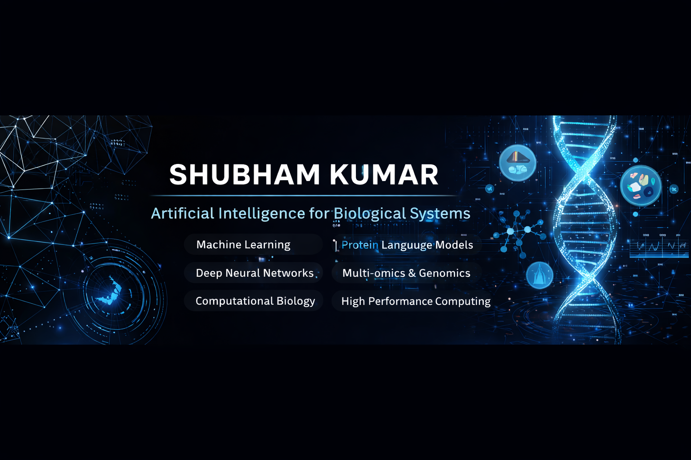

  

# Hi, I'm Shubham Kumar 👋

Bioinformatics AI researcher working at the intersection of **machine learning and biological systems**.
My work focuses on developing **AI-driven models and scalable computational pipelines for biological data analysis**, including protein sequence modeling, genomics, and multi-omics data.

---

## 🔬 Research Interests

* Machine Learning for Biological Systems
* Protein Sequence Modeling
* Genomics & Multi-omics Data Analysis
* Deep Learning for Biomedical Data
* Scalable AI Pipelines for Scientific Computing

---

## 🧠 Technical Skills

**Programming**

Python, R, Bash, Linux/Unix

**Machine Learning**

Scikit-learn, XGBoost, Random Forest, SVM

**Deep Learning**

PyTorch, TensorFlow, Keras
CNN • RNN • GRU • BiLSTM • Transformers

**Protein & AI Models**

Protein Language Models (ESM, ProtBERT, ProtT5)

**Bioinformatics**

Protein sequence analysis
Genomics and multi-omics data analysis

**Infrastructure & Tools**

Docker • Streamlit • Git • HPC Clusters (PBS)

---

## 🚀 Current Work

* Building **AI models for biological sequence analysis**
* Developing **scalable machine learning pipelines for biological datasets**
* Creating **interactive bioinformatics tools using Streamlit and Docker**
* Working on **large-scale biological data analysis using HPC systems**

---

## 🏆 Achievements

**Best Paper Award — IEEE ICRITO 2025**

Comparing CNNs and Transformers for biomedical image classification.

---

## 📚  Publications

**Comparing Pre-Trained CNNs and Transformers for Knee Osteoarthritis Severity Detection**
*IEEE ICRITO 2025* — First Author
This study evaluates the performance and representational differences between convolutional neural networks and transformer architectures for modern medical image classification.

**CNNs and Transformers: Unraveling Their Impact on Modern Medical Image Classification**
*IEEE ICRITO 2025* — Co-author
A review exploring the evolving role of CNNs and transformer architectures in medical image analysis.

**From Plants to Potential Therapeutics: Exploring Neuroprotective Properties against Alzheimer’s Disease through Molecular Docking and Molecular Dynamics Simulations**
*Aging Pathobiology and Therapeutics* — First Author
This work investigates plant-derived bioactive compounds as potential neuroprotective agents using molecular docking and molecular dynamics simulations.

**Book Chapter — Big Data in Bioinformatics and Computational Biology: Basic Insights**
*Methods in Molecular Biology (Springer Protocols)*
Focuses on computational approaches for analyzing large-scale biological datasets.

**Book Chapter — AI-based Protein Structure Prediction and Respective Analysis**
*Artificial Intelligence in Cell and Genetic Engineering (Springer Protocols)*
Discusses the role of artificial intelligence in protein structure prediction and structural bioinformatics.

---

## 🛠 Featured Areas of Work

* Artificial Intelligence for Biological Systems
* Computational Biology
* Machine Learning for Genomics
* Biomedical Data Analysis
* Scalable AI Research Pipelines

---

## 📫 Contact

Email: **[shubham.kum3105@gmail.com](mailto:shubham.kum3105@gmail.com)**

---
